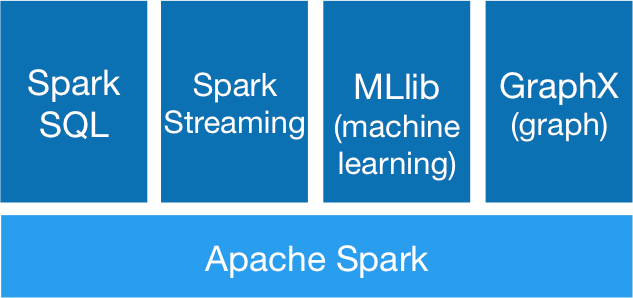

# An Introduction to Apache Spark

Dirk Hesse

[dirk.hesse@intelcom.no](mailto:dirk.hesse@intelcom.no "Send me a
mail") | [@NotDirkHesse](https://twitter.com/NotDirkHesse "I tweet sporadically")

---

## Outline

### A highly personal view on Spark

- What is Spark?
- Mandatory word count example.
- Spark's MLLIB.
- Getting data into Spark.
- Spark streaming.
- Spark and unit testing.
- Cluster deployment.

---

From [spark.apache.org](http://spark.apache.org/)

> Apache Spark™ is a fast and general engine for large-scale data
> processing.

---

## So what *is* Spark?!

Spark helps analyzing big data sets

- from **heterogeneous** data sources,
- **in memory**,
- in *Java*, *Scala*, *Python*, and *R*
- with many back-ends and extensions.

---

## Let's use it to count words!

[Live Demo](http://localhost:8889/notebooks/WordCount.ipynb)

---

## SparkContext and RDD
## An Inside Look

[Live Demo](http://localhost:8889/notebooks/A%20Nerdy%20Look%20at%20SC%20and%20RDD.ipynb)

---

# MLLIB: Built-in Machine Learning

Spark comes with machine learning on-board:

- **Classification**: Logistic Regression, SVM, Naïve Bayes
- **Clustering**: K-Means, Gaussian Mixture
- **Regression**: Linear, Ridge, Lasso, Isotonic
- **Trees**: Decision Tree, Random Forest, Gradient Boosted
- **Recommendation**: Matrix Factorization only

All easy(ish) to use.

---

# MLLIB

[Live Demo](http://localhost:8889/notebooks/MLLIB.ipynb)

In which we predict survival of the **Titanic** disaster.

<pre>
PassengerId; Survived; Pclass; Name; Sex; Age; SibSp; Parch; Ticket; Fare; Cabin; Embarked
1; 0; 3; Braund, Mr. Owen Harris; male; 22; 1; 0; A/5 21171; 7.25; ; S
2; 1; 1; Cumings, Mrs. John Bradley (Florence Briggs Thayer); female; 38; 1; 0; PC 17599; 71.2833; C85; C
3; 1; 3; Heikkinen, Miss. Laina; female; 26; 0; 0; STON/O2. 3101282; 7.925; ; S
4; 1; 1; Futrelle, Mrs. Jacques Heath (Lily May Peel); female; 35; 1; 0; 113803; 53.1; C123; S
</pre>

---

## Getting data into Spark

In addition to methods in `SparkContext`, **tons** of **libraries**
exist, e.g.

<table>
<tr>
<td>

<ul>
<li> spark-avro
<li> spark-redshift
<li> spark-mongodb
<li> spark-csv
<li> spark-sequoiadb
</ul>

<td>

<ul>
<li> spark-cassandra-connector
<li> elasticsearch-hadoop
<li> pyspark-elastic
<li> spark-cloudant
<li> couchbase-spark-connector
</ul>

</tr>
</table>

---

